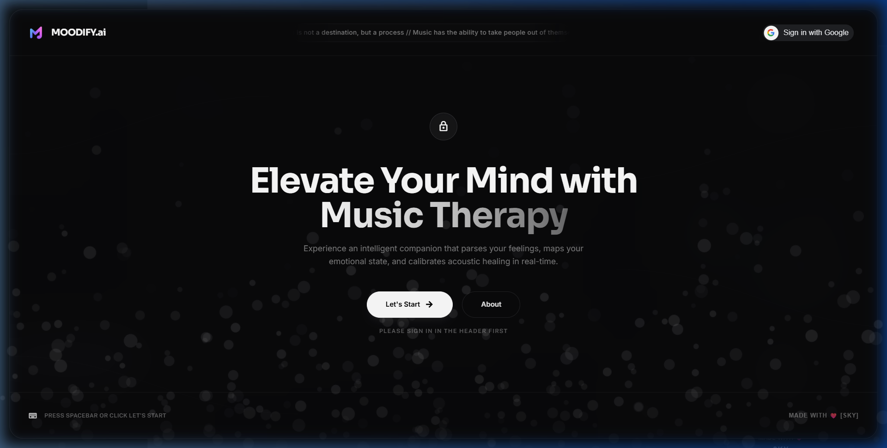
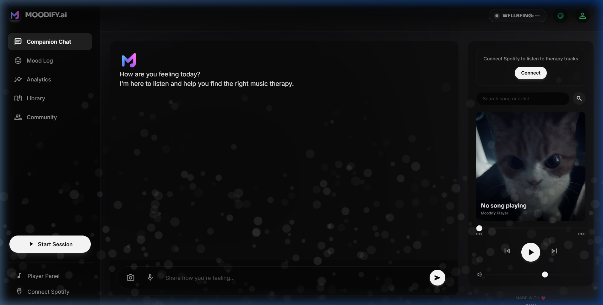
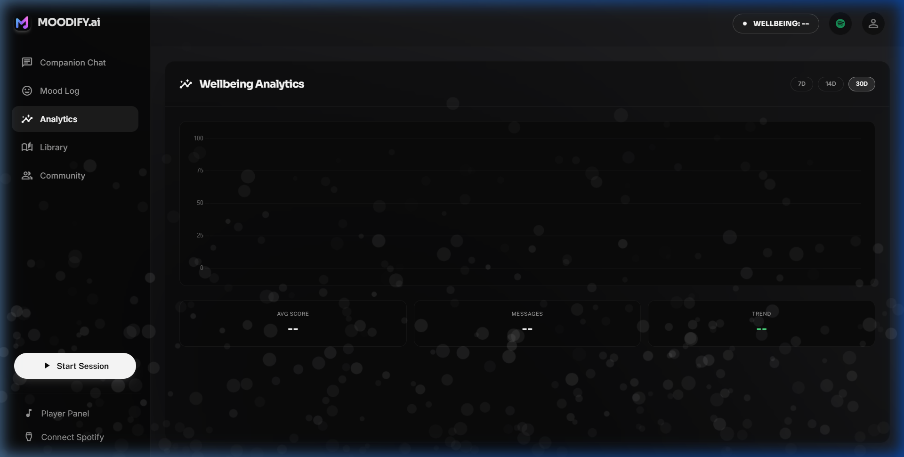
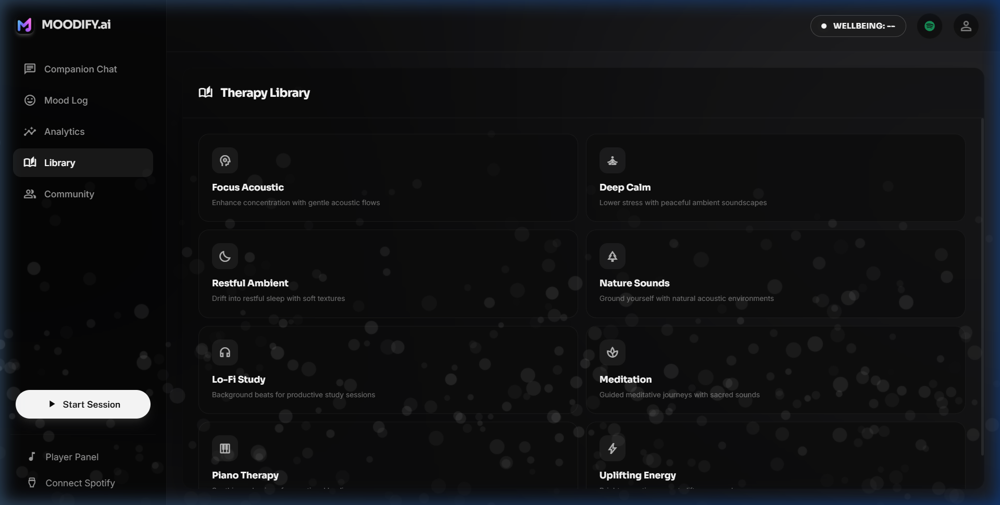
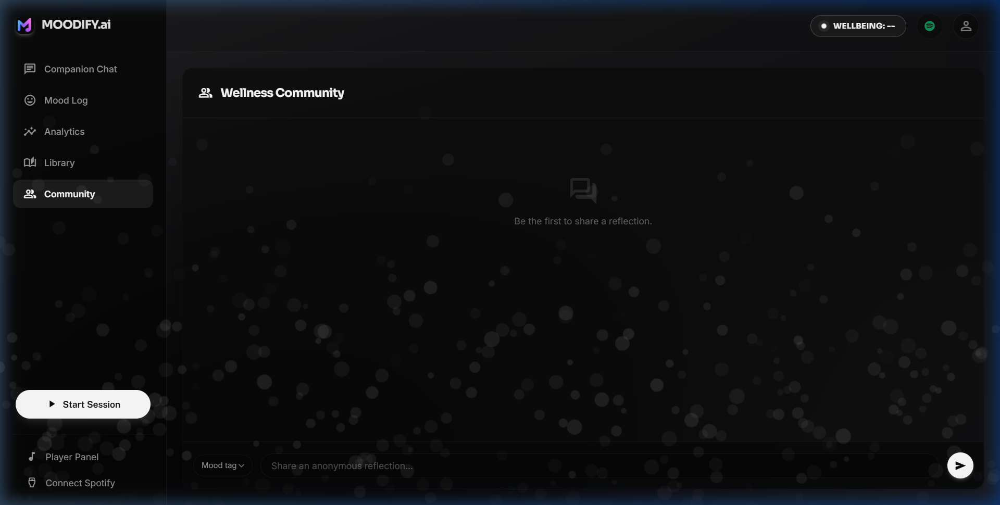
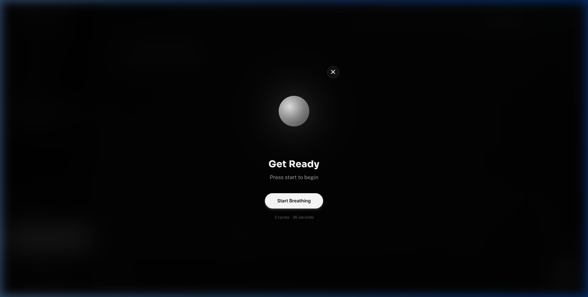
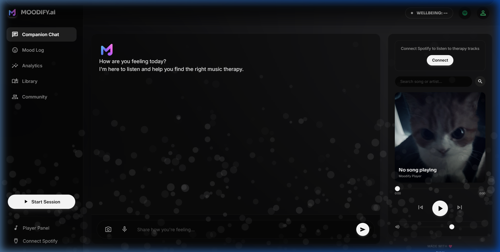

# 🎧 MOODIFY.ai

### AI Emotional Companion with Intelligent Music Therapy


---

## 🌌 Overview

**MOODIFY.ai** is a premium emotional wellbeing platform that combines:

* 💬 Empathetic AI conversation powered by Groq LLM
* 🎧 Mood-based music therapy via Spotify
* 🎙 Voice interaction with speech-to-text
* 🎭 Multi-modal emotion detection (text, face, voice)
* 📊 Persistent wellbeing analytics & mood tracking
* 📚 Curated therapy music library
* 🫧 Guided breathing & meditation sessions
* 🤝 Anonymous wellness community board

The system blends **AI psychology principles with music recommendation** to create a supportive digital companion for students and young adults.

---

## 📷 Gallery

### 🌌 Lock Screen & Landing Page


### 💬 Companion Chat Dashboard


### 📊 Wellbeing Analytics


### 📚 Therapy Music Library


### 🤝 Wellness Community Board


### 🫧 Guided Breathing Session


### 🎵 Spotify Player Drawer


---

## ✨ Key Features

### 💬 AI Emotional Companion

* Natural conversation with **Groq LLM (Llama-3.3-70B)**
* **Warrior-Poet / Brutally Honest Persona**: MOODIFY is not a generic, overly polite AI. It behaves like a battle-scarred mentor—brutally honest, straightforward, and critical of excuses, but deeply caring and committed to guiding you back to strength.
* Supports **English, Hindi, and Hinglish**
* Emotion-aware responses calibrated to your mood
* Crisis detection with supportive emergency interventions
* Persistent chat history — conversations continue across sessions

Example interaction:

```
User: I feel really stressed today

AI: That sounds overwhelming. Want to talk about what's making
    today difficult? Maybe we can find something relaxing together.
```

---

### 🎵 AI Music Therapy Engine

MOODIFY controls Spotify using natural language:

```
play kesariya
play arijit singh
play relaxing music
skip this song
pause music
```

Features:
* ✔ AI music intent understanding
* ✔ Spotify Web Playback SDK integration
* ✔ Infinite autoplay playlist generation
* ✔ Wellbeing-score-based recommendations
* ✔ Album artwork, progress slider, volume control

---

### 🧠 Wellbeing Score

MOODIFY tracks emotional trends and calculates a **dynamic wellbeing score**:

| Score  | Meaning         |
| ------ | --------------- |
| 0–20   | Severe distress |
| 21–40  | Struggling      |
| 41–60  | Mixed emotions  |
| 61–80  | Stable          |
| 81–100 | Positive        |

The score updates in real-time with exponential smoothing as conversations evolve.

---

### 📊 Wellbeing Analytics Dashboard

Track your emotional journey over time with a full analytics view:

* **Chart.js line graph** of daily wellbeing scores
* **7-day / 14-day / 30-day** range selectors
* **Summary stats**: Average score, total messages, trend direction (↑↓)
* Data persisted in SQLite — survives server restarts

---

### 📝 Mood Log

A detailed chronological log of every conversation entry:

* Date & time of each message
* Truncated message preview
* Color-coded wellbeing score badges (🟢 green / 🟡 yellow / 🔴 red)
* Detected emotion label

---

### 📚 Therapy Music Library

Browse 8 curated acoustic therapy categories:

| Category | Description |
| --- | --- |
| 🧠 Focus Acoustic | Gentle instrumental flows for concentration |
| 🧘 Deep Calm | Peaceful ambient soundscapes |
| 🌙 Restful Ambient | Soft textures for sleep |
| 🌿 Nature Sounds | Rain, forest, ocean environments |
| 🎧 Lo-Fi Study | Background beats for study sessions |
| 🧘 Meditation | Tibetan bowls & sacred sounds |
| 🎹 Piano Therapy | Solo piano for emotional healing |
| ⚡ Uplifting Energy | Bright acoustic mood lifters |

Click any category → Spotify plays matching tracks instantly.

---

### 🫧 Guided Breathing Sessions

A full-screen meditation overlay with:

* **Animated breathing orb** — scales up on inhale, pulses on hold, scales down on exhale
* **3-cycle 4-4-4 breathing pattern** (inhale · hold · exhale)
* **Session logging** — duration, wellbeing before/after saved to database
* Glassmorphism dark UI with smooth CSS transitions

---

### 🤝 Wellness Community Board

An anonymous space for emotional sharing:

* Post reflections with mood tags (😊 😌 😢 😰 🙏 🌟)
* Auto-generated anonymous aliases (e.g., "Serene Wave", "Crystal Phoenix")
* Read others' reflections for shared comfort
* Public read access, authenticated write access

---

### 🎭 Emotion Detection

MOODIFY understands emotions using multiple signals:

| Channel | Technology |
| --- | --- |
| Chat text | DistilRoBERTa emotion model |
| Facial expression | DeepFace facial analysis |
| Voice tone | Speech-to-text + acoustic analysis |

These signals personalize AI responses and music suggestions.

---

### 🎙 Voice Assistant

* Speech-to-text conversation via browser microphone
* AI voice replies with text-to-speech
* Siri-like pulsating orb visualizer during recording
* Emotional conversation through voice

---

### 🔐 Google OAuth Authentication

* Secure sign-in via Google Identity Services
* User profile stored in SQLite database
* Login activity logged with timestamps and IP addresses

---

## 🧠 System Architecture

```
         User Interaction
        /      |       \
       /       |        \
    Text     Voice     Camera
     │         │         │
     ▼         ▼         ▼
  Emotion Detection (AI Models)
            │
            ▼
         Groq LLM
   (Conversation Intelligence)
            │
      ┌─────┼─────┐
      │     │     │
      ▼     ▼     ▼
   Music  Reply  Score
   Intent       Wellbeing
      │     │     │
      ▼     ▼     ▼
   Spotify  Chat   SQLite
   Playback Window Database
                    │
              ┌─────┼─────┐
              │     │     │
              ▼     ▼     ▼
          Analytics Mood  Community
          Dashboard  Log   Board
```

---

## 🏗 Tech Stack

### Backend
* **FastAPI** — high-performance Python web framework
* **SQLite** — persistent storage with WAL mode for concurrency
* **Google OAuth** — secure authentication via Identity Services

### AI & Machine Learning
* **Groq LLM** (Llama-3.3-70B) — conversation intelligence
* **HuggingFace Transformers** — DistilRoBERTa emotion detection
* **DeepFace** — facial emotion analysis

### Frontend
* **HTML5** — semantic structure
* **CSS3** — obsidian glassmorphism UI with micro-animations
* **JavaScript** — vanilla ES6+ with modular architecture
* **Chart.js** — wellbeing analytics visualization
* **Tailwind CSS** — utility-first styling

### Music Integration
* **Spotify Web Playback SDK** — in-browser music player
* **Spotify Web API** — search, recommendations, playback control

---

## 📂 Project Structure

```
MOODIFY.ai
│
├── frontend/
│   ├── index.html            # Main SPA with 5 view panels
│   ├── moodify.css           # Custom animations & component styles
│   ├── script.js             # Core logic, tab switching, analytics
│   └── assets/               # Logo, icons, static media
│
├── backend/
│   ├── main.py               # FastAPI routes & API endpoints
│   ├── database.py           # SQLite schema, CRUD operations
│   ├── conversation_memory.py # Per-user persistent chat memory
│   ├── spotify_service.py    # Spotify OAuth & playback control
│   ├── llm_response.py       # Groq LLM integration
│   ├── text_emotion.py       # Text sentiment analysis
│   ├── mental_state.py       # Wellbeing score calculator
│   ├── voice_assistant.py    # Speech-to-text processing
│   ├── voice_emotion.py      # Voice acoustic analysis
│   ├── ai_voice.py           # Text-to-speech replies
│   ├── camera_stream.py      # Camera feed handler
│   └── live_face_emotion.py  # Real-time facial emotion
│
├── docs/screenshots/          # UI screenshots for README
├── requirements.txt
├── .env                       # API keys (not committed)
└── README.md
```

---

## ⚙️ Installation

Clone the repository:

```bash
git clone https://github.com/imsky1812/MOODIFY.ai.git
cd MOODIFY.ai
```

Create virtual environment:

```bash
python -m venv venv
venv\Scripts\activate        # Windows
source venv/bin/activate     # macOS/Linux
```

Install dependencies:

```bash
pip install -r requirements.txt
```

---

## 🔑 Environment Variables

Create a `.env` file in the project root:

```env
GROQ_API_KEY=your_groq_api_key

SPOTIFY_CLIENT_ID=your_spotify_client_id
SPOTIFY_CLIENT_SECRET=your_spotify_secret
SPOTIFY_REDIRECT_URI=http://127.0.0.1:8000/callback

GOOGLE_CLIENT_ID=your_google_client_id
```

---

## ▶️ Run the Application

Start the FastAPI server:

```bash
uvicorn backend.main:app --reload
```

Open in browser:

```
http://127.0.0.1:8000
```

The SQLite database (`moodify.db`) is created automatically on first startup.

---

## 🚀 Future Roadmap

* 🧠 AI music memory — remember user's listening preferences
* 📈 Weekly/monthly wellbeing reports with PDF export
* 🎵 AI-generated playlists based on emotional patterns
* 🌐 Multi-language community support
* 📱 Progressive Web App (PWA) for mobile

---

## ⚠️ Disclaimer

MOODIFY.ai is **not a medical or psychological service**.
It is designed as a supportive companion and should not replace professional mental health care.

---

## 👨‍💻 Author

Developed by **Sarvesh Kumar Yadav**

---

## ⭐ Support the Project

If you like this project:

⭐ Star the repository
🐛 Report bugs
🚀 Suggest improvements

Your support helps make MOODIFY.ai better.
